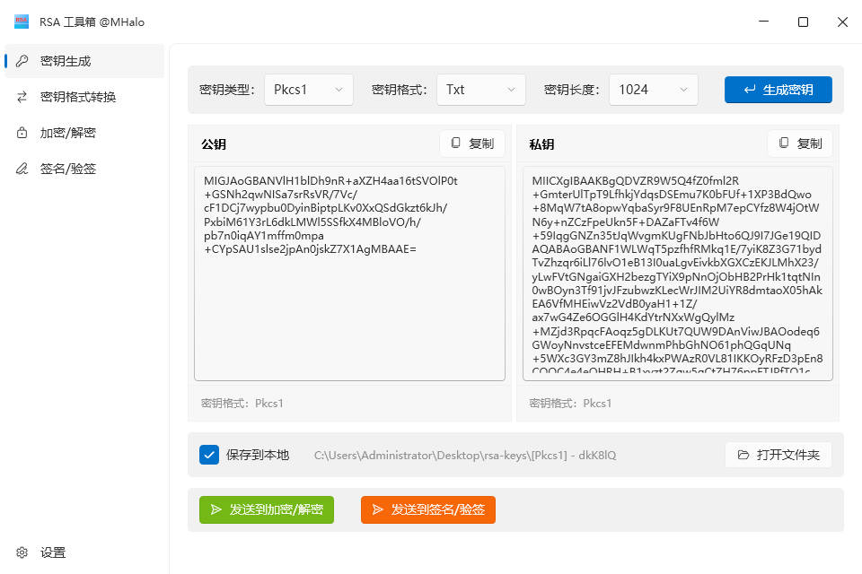
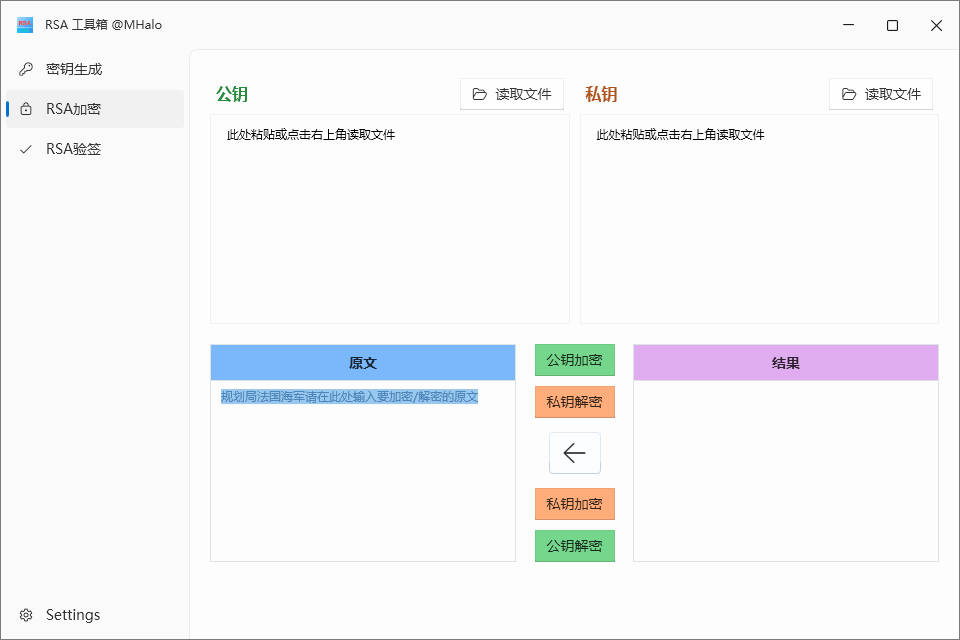

# MHalo.CoreFx.RsaToolBox

  
  

## 🟢  Features
- [x] 密钥生成
- [x] 加密/解密
- [ ] 签名/验签  
- [ ] 密钥格式转换

## 🟠 Bug 和需求反馈
如果想要反馈 Bug、提供意见，可以创建 Github issue 或 添加微信(备注RSA) 联系，十分感谢！ 

## 🔵 更新日志
- 2024-05-16  
优化已有功能
- 2024-05-14  
完成密钥加密/解密界面及功能
- 2024-05-13  
创建项目，完成密钥生成界面及功能
