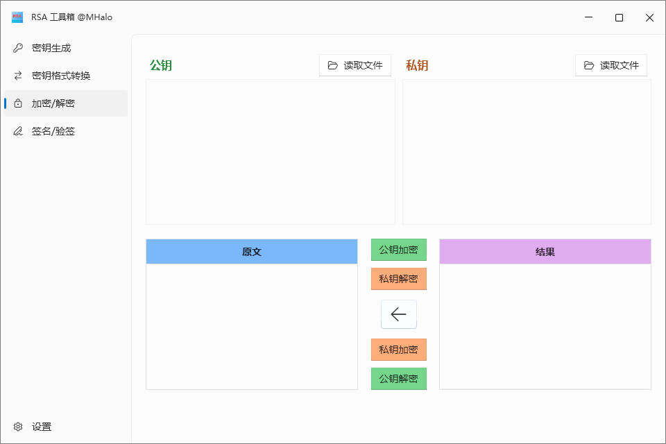

# MHalo.CoreFx.RsaToolBox

<table style="border:none">
<tr style="border:none;background:transparent;">
<td style="border:none">

密钥生成

</td>
<td style="border:none">

密钥格式转换

</td>
</tr>
<tr style="border:none;background:transparent;">
<td style="border:none">

加密/解密

</td>
<td style="border:none">

签名/验签

</td>
</tr>
</table>

## 🟢  Features
- [x] 密钥生成
- [x] 加密/解密
- [x] 签名/验签  
- [x] 密钥格式转换

## 🟠 Bug 和需求反馈
如果想要反馈 Bug、提供意见，可以创建 Github issue 或 添加微信(备注RSA) 联系，十分感谢！ 

## 🔵 更新日志
- 2024-05-21   
1.签名/验签时增加算法选择
2.使用[`NetBeauty`](https://github.com/nulastudio/NetBeauty2)优化发布配置
- 
- 2024-05-17   
完成全部功能的初始版本
- 2024-05-16    
优化已有功能
- 2024-05-14  
完成密钥加密/解密界面及功能
- 2024-05-13  
创建项目，完成密钥生成界面及功能
